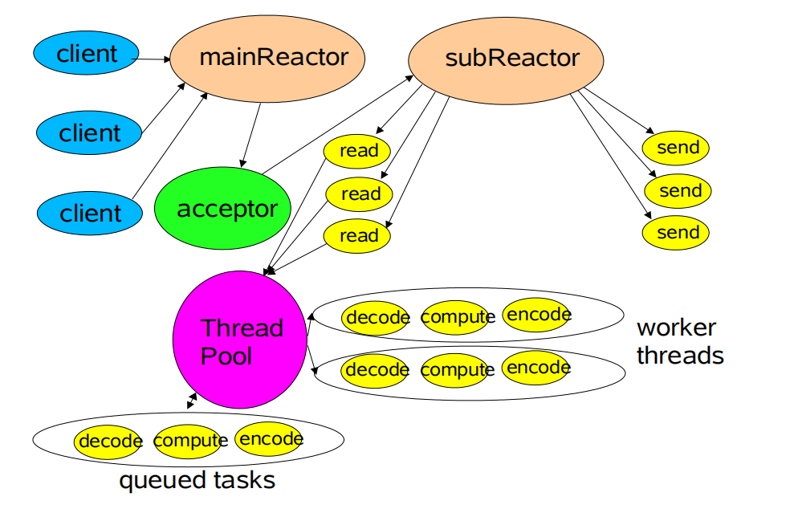

# 一个简化版的 WebServer

## 已完成功能

- HTTP Protocol
- Servlet
- ServletContext
- Request
- Response
- Post & Get
- web.xml parse
- Reactor NIO
- Cookie
- Session
- Filter
- 302 Redirect
- Static Resources & File Download
- 304 Cache

## 项目运行流程

- 服务端启动，静态生成 ServlectContext 解析 web.xml，生成对应 URL 和 Servlect 、Filter 映射，Socket 开始监听请求。
- 浏览器发送 URL 请求，GET 带参数。
- 通过 NIO Contector 获取 HTTP  报文数据。
- WebServer 解析 HTTP 协议（请求方法、请求 uri，请求头参数，请求体），提取 uri 和 Body 中的请求参数，生成 Request。
- 根据 uri 获取对应 Servlect 容器和 Filter 拦截器链进行后台处理逻辑。
- Servlet、Filter 可使用 302 重定向进行访问跳转。
- 对于静态资源访问单独进行处理，可设定 cache-control:max-age=xxx、Etag:xxx 进行缓存。
- 服务端可生成唯一 ID 的 Session，可通过 Response 的 Set-cookie 将 ID 传递给客服端，客户端通过 cookie:ID，来获取对应 Session。
- 服务端处理完逻辑后生成数据写入 Response，回传给客户端，如果为 keep-live，则保持连接。

## 主从 Reactor

- 一个 mainReactor (ServerSocketChannel) 线程用来负责监听 acceptor 请求，通过 selector 轮询每次将多个连接请求派发给 subReactor 处理。
- 创建多个 subReactor，每个 subReactor 运行在一个线程。subReactor 将处理 mainReactor 的连接，通过 selector 监听读写请求。
- subReactor 监听到读请求后在当前线程读出二进制数据，并将数据委派给线程池来执行业务逻辑（包括构建 Request）。当处理完数据，则将当前连接的 subReactor 的监听置为写，等待 subReactor 写回客户端。

